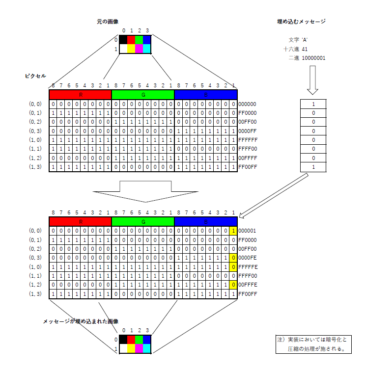

# steganography

steganography.py

# Features
入力画像にメッセージを埋め込みます。
メッセージが埋め込まれた画像からメッセージを取得します。

# Usage

python steganography.py -a -i <input_image> -o <output_image> -p <password> -m <message_file>

python steganography.py -x -o <output_image> -f <output_file> -p <password> -f <output_file>
 
 
 
 
# Options
 
  -a, --add  メッセージを埋め込む

  -x, --expand  メッセージを取得する
  
  -i, --input_image 入力画像
  
  -o, --output_image  出力画像
  
  -m, --message_file 入力メッセージファイル
  
  -f, --output_file 出力メッセージファイル
  
  -p, --password  パスワード
 
 
